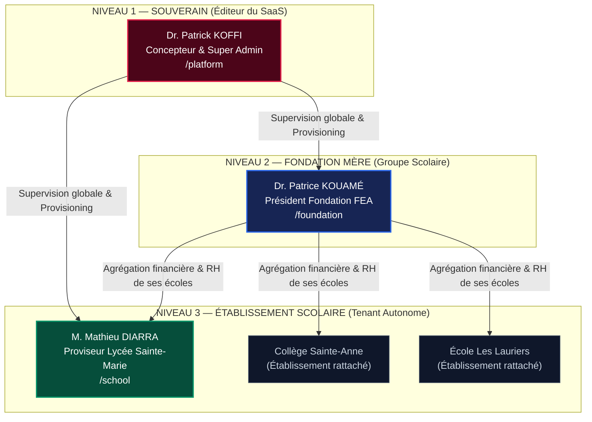

# ScolaPro — Plateforme SaaS Multi-Tenant de Gestion Scolaire & Financière

[](https://nodejs.org/)
[](package.json)
[](#-architecture-hiérarchique-à-3-niveaux)
[](schema.sql)
[](.github/workflows/ci.yml)
[](#-spécificités-régionales--réglementaires)

**ScolaPro** est une solution logicielle SaaS de référence conçue pour la gouvernance administrative, pédagogique et la gestion financière rigoureuse des établissements scolaires, collèges, lycées et groupes éducatifs en Afrique de l'Ouest (Zone UEMOA).

---

## 🏛️ Architecture Hiérarchique à 3 Niveaux

ScolaPro intègre un modèle de contrôle d'accès hermétique empêchant toute escalade de privilèges ascendante :



| Compartiment | Rôle Principal | Périmètre & Isolation | URL d'Accès |
| :--- | :--- | :--- | :--- |
| **Niveau 1 — Concepteur** | Super Admin Plateforme | Accès souverain global (Toutes fondations, toutes écoles, supervision système, maintenance). | [`/platform`](http://localhost:3005/platform) |
| **Niveau 2 — Fondation** | Président de Groupe Éducatif | Vue consolidée sur ses propres établissements. Interdiction stricte de toucher aux configurations souveraines. | [`/foundation`](http://localhost:3005/foundation) |
| **Niveau 3 — École** | Proviseur & Équipes École | Confinement strict aux élèves, classes, caisses et enseignants de l'établissement. | [`/school`](http://localhost:3005/school) |

---

## ⚡ Points Forts & Choix Technologiques

* **Zéro Dépendance Externe en Exécution :** Propulsé exclusivement par les modules natifs de Node.js (`http`, `fs`, `path`, `crypto`) et le moteur SQLite officiel haute performance `node:sqlite` (`DatabaseSync` en mode WAL avec `busy_timeout`).
* **Intégrité Financière ACID (SYSCOHADA) :** Transactions atomiques garanties (`BEGIN TRANSACTION ... COMMIT`) lors des transferts inter-caisses et des encaissements d'écolages.
* **Sécurité & En-têtes HTTP de Production :** Protection native contre le clickjacking (`X-Frame-Options: SAMEORIGIN`), le sniffing MIME (`X-Content-Type-Options: nosniff`), le cross-site scripting (`X-XSS-Protection`) et politique de référencement stricte.
* **Double Cible de Persistance :** Déploiement ultra-léger instantané sur SQLite en local / Edge, et schéma SQL d'entreprise prêt pour PostgreSQL 14+ (`schema.sql`).
* **Healthcheck Intégré :** Endpoint `/health` et `/api/health` pour la supervision continue par les reverse-proxies (Nginx, AWS ALB, Cloudflare).

---

## 🚀 Démarrage Rapide

### 1. Prérequis
* **Node.js >= 22.5.0** (Requis pour l'API native `node:sqlite`).

### 2. Installation & Lancement
```bash
# 1. Cloner le référentiel
git clone https://github.com/votre-organisation/scolapro.git
cd scolapro

# 2. Configurer les variables d'environnement
cp .env.example .env

# 3. Démarrer le serveur (Port 3005 par défaut)
npm start

# Ou en mode développement avec rechargement à chaud :
npm run dev
```

### 3. Accès aux Portails
* **Portail Concepteur (Niveau 1) :** [http://localhost:3005/platform](http://localhost:3005/platform)
* **Portail Fondation (Niveau 2) :** [http://localhost:3005/foundation](http://localhost:3005/foundation)
* **Espace École (Niveau 3) :** [http://localhost:3005/school](http://localhost:3005/school)
* **Healthcheck Serveur & DB :** [http://localhost:3005/health](http://localhost:3005/health)

---

## 🧪 Tests Automatisés & Vérifications

ScolaPro utilise le banc d'essai natif de Node.js (`node:test` & `node:assert`), sans alourdir le projet d'outils tiers comme Jest ou Mocha :

```bash
# Exécuter la suite de tests automatisés
npm test

# Vérifier la syntaxe de tous les fichiers JavaScript
npm run lint

# Purger et réinitialiser les données de production
npm run db:sanitize
```

### Couverture des Tests Intégrés :
- `tests/health.test.js` : Vérification du statut UP, des en-têtes HTTP de sécurité et de la connectivité DB.
- `tests/rbac_isolation.test.js` : Vérification de l'étanchéité 3-tiers et du blocage HTTP 403 Forbidden sur tentative d'escalade.
- `tests/financial_acid.test.js` : Vérification de l'atomicité financière des paiements, des versements inter-caisses et du verrou anti-suppression d'élèves cotisants.

---

## 🌍 Spécificités Régionales & Réglementaires

* **Devise Intégrale :** Franc CFA (XOF / UEMOA) traité en montants entiers stricts.
* **Format Matricule MENA :** Normalisation conforme aux directives des Ministères de l'Éducation Nationale d'Afrique de l'Ouest (ex: `23019284K`).
* **Comptabilité Inter-Caisses :** Double écriture comptable conforme SYSCOHADA (Bordereaux de versement `DEP-YYYY-XXXX`, Quittances sécurisées `QUIT-YYYY-XXXX`).
* **Protection des Données Personnelles :** Conformité aux principes de l'APDP (Côte d'Ivoire - Loi n° 2013-450) pour le traitement des données des élèves mineurs.

---

## 📁 Structure du Projet

```text
scolapro/
├── .github/
│   └── workflows/
│       └── ci.yml               # Pipeline d'intégration continue GitHub Actions
├── tests/
│   ├── health.test.js           # Tests de l'endpoint de santé et headers HTTP
│   ├── rbac_isolation.test.js   # Tests d'étanchéité multi-tenant & 403 Forbidden
│   └── financial_acid.test.js   # Tests transactions atomiques & règles de caisse
├── .editorconfig                # Standardisation des indentations et encodages
├── .env.example                 # Modèle des variables de configuration
├── .gitignore                   # Exclusions strictes des bases .db et secrets .env
├── config.js                    # Configuration publique immuable côté client
├── db.js                        # Moteur SQLite persistant (node:sqlite WAL)
├── index.html                   # Application Frontend & Shells multi-compartiments
├── inscription.html             # Portail web d'enrôlement des nouveaux élèves
├── package.json                 # Définition du projet et scripts Node.js
├── PRODUCTION_GUIDE.md          # Guide officiel de déploiement et référentiel
├── schema.sql                   # Schéma relationnel d'entreprise (PostgreSQL 14+)
└── server.js                    # Noyau serveur HTTP natif, sécurité et API REST
```

---

## 🔐 Sécurité & Bonnes Pratiques

* Les bases de données SQLite locales (`*.db`, `*.db-wal`, `*.db-shm`) et les fichiers de secrets (`.env`, `.env.production`) sont protégés par le `.gitignore` et **ne doivent jamais être publiés dans un commit public**.
* En environnement de démonstration locale, le serveur permet la simulation des rôles pour faciliter les revues UX. En production externe, activez impérativement la signature cryptographique des sessions JWT (voir `PRODUCTION_GUIDE.md`).

---

## 🏢 Éditeur & Propriété Intellectuelle

Développé et édité par **INNOVA GROUP** — Abidjan, Côte d'Ivoire.  
Tous droits réservés © 2026.
