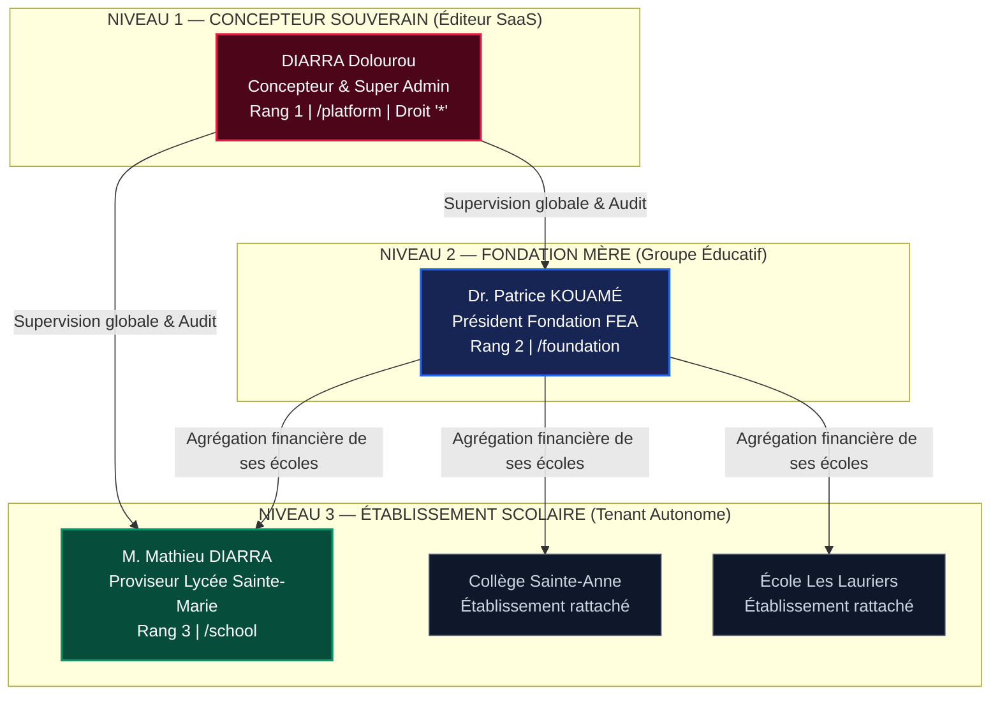

# ScolaPro — Plateforme SaaS Multi-Tenant de Gestion Scolaire & Financière

[](https://nodejs.org/)
[](package.json)
[](#-suite-de-tests-automatisés)
[](SECURITY.md)
[](#-spécificités-financières--réglementaires)

**ScolaPro** est une plateforme logicielle SaaS multi-tenant de référence dédiée à la gouvernance administrative, pédagogique et à la gestion de caisse rigoureuse des établissements scolaires, collèges, lycées et groupes éducatifs en Afrique de l'Ouest (Zone UEMOA, monnaie Franc CFA / XOF).

Version durcie **v2.5.0** : architecture étanche conçue pour manipuler de l'argent réel et des données personnelles d'élèves mineurs conformément aux exigences de l'**APDP** et de la comptabilité **SYSCOHADA**.

---

## 🏛️ Architecture Hiérarchique & Modèle RBAC

ScolaPro applique un cloisonnement hermétique à 3 niveaux interdisant toute escalade de privilèges verticale ou horizontale :



### Grille des 6 Rôles RBAC Officiels (`lib/rbac.js`)

| Rôle | Rang | Périmètre d'Accès | Habilitations Clés |
| :--- | :---: | :--- | :--- |
| **`concepteur`** | **1** | Multi-tenant global (toutes écoles) | Super-administrateur souverain, seul habilité à détenir `'*'`, provisionner des fondations et opérer l'impersonation de support. |
| **`fondateur`** | **2** | Multi-écoles de sa fondation | Supervision financière consolidée et indicateurs de performance de ses établissements rattachés. |
| **`admin_ecole`** | **3** | Établissement propre | Gestion des inscriptions, classes, enseignants et création de comptes opérationnels d'école. |
| **`comptable`** | **4** | Caisse de l'établissement | Encaissement d'écolages, émission de quittances et validation des versements inter-caisses. |
| **`secretaire`** | **4** | Scolarité de l'établissement | Saisie administrative, enrôlement d'élèves, impression des listes et bordereaux. |
| **`consultation`**| **4** | Établissement propre | Consultation en lecture seule sans droit de modification ni de suppression. |

---

## ⚡ Caractéristiques Techniques & Sécurité

- **Zéro Dépendance d'Exécution :** Aucune dépendance externe dans `package.json`. L'intégralité du backend repose exclusivement sur les modules natifs Node.js (`http`, `fs`, `path`, `crypto`, `node:sqlite`).
- **Authentification Robuste :** Hachage des mots de passe par `scrypt` ($N=32768, r=8, p=1, \text{keylen}=64$), comparaison en temps constant (`crypto.timingSafeEqual`), jetons de session cryptographiques de 256 bits, cookies `HttpOnly`, `SameSite=Strict`, `Secure`.
- **Politique Anti-Bruteforce :** Verrouillage automatique de compte après 5 tentatives infructueuses consécutives avec temporisation et audit en base SQLite.
- **Protection Réseau & Anti-CSRF :**
  - Vérification stricte des origines (`Origin` et `Referer`) sur toutes les requêtes mutatrices (POST, PUT, DELETE).
  - Limiteur de débit in-memory (600 req/min global, 10 tentatives/min sur l'authentification).
  - Analyseur de corps JSON plafonné à 512 KiB avec rejet HTTP 413 et drainage de flux pour éviter les blocages TCP.
  - Neutralisation de la pollution de prototype (`__proto__`, `constructor`, `prototype`).
- **Isolation Multi-Tenant Étanche :** Requêtes SQL cloisonnées au niveau DAO (`db.js`), interdiction formelle des accès IDOR et rejet systématique des requêtes ciblant un autre établissement (`TENANT_CROSS_WRITE`).
- **En-têtes de Sécurité HTTP :** Envoi systématique de `Content-Security-Policy`, `X-Content-Type-Options: nosniff`, `X-Frame-Options: SAMEORIGIN`, `Cross-Origin-Opener-Policy: same-origin`, `Cross-Origin-Resource-Policy: same-origin`.
- **Assainissement des Sorties (Anti-XSS) :** Remplacement de plus de 640 interpolations vulnérables par des fonctions contextuelles natives `esc()` et `escJs()`. Éradication complète de la porte dérobée `_bypassSecurityForTest`.

---

## 💰 Moteur Financier ACID & Invariant SYSCOHADA

Le module financier applique rigoureusement les normes comptables de l'Afrique de l'Ouest :

1. **L'Invariant Financier Absolu :**
   $$\forall \text{ Établissement}, \quad \sum \text{soldes des caisses} = \sum \text{encaissements enregistrés}$$
2. **Isolation des Caisses Principales :** Chaque établissement dispose de sa propre caisse principale isolée (`PRINCIPALE` pour l'École 1, `S2_PRINCIPALE` pour l'École 2, etc.). Les versements inter-caisses créditent exclusivement la caisse principale de l'école concernée.
3. **Transactions ACID Atomiques :** Utilisation de `BEGIN IMMEDIATE` / `COMMIT` sur SQLite en mode WAL (`node:sqlite`). Toute anomalie ou solde insuffisant déclenche un rollback immédiat.
4. **Séparation des Tâches :** L'agent ayant initié un bordereau de versement ne peut pas valider lui-même la transaction (`CASH_DEPOSIT_SAME_USER`).
5. **Protection Anti-Fraude :** Rejet des montants décimaux (devise Franc CFA en montants entiers stricts), rejet des montants négatifs ou nuls, plafonnement à 50 000 000 XOF, et interdiction de percevoir un montant supérieur au reliquat de scolarité de l'élève.
6. **Verrou Anti-Suppression :** Tout élève ayant au moins un versement enregistré en base ne peut être supprimé (`STUDENT_HAS_PAYMENTS`).

---

## 🚀 Démarrage Rapide

### 1. Prérequis
- **Node.js >= 22.5.0** (obligatoire pour le module natif `node:sqlite`).

### 2. Installation & Configuration
```bash
# 1. Cloner le projet
git clone https://github.com/votre-organisation/scolapro.git
cd scolapro

# 2. Configurer les variables d'environnement
cp .env.example .env

# 3. Initialiser ou réinitialiser le mot de passe souverain
node scripts/set-password.js admin@scolapro.ci "MotDePasseTresFort!2026"

# 4. Démarrer le serveur HTTP sécurisé (Port 3005 par défaut)
npm start
```

### 3. Points d'Entrée
- **Portail de Connexion Unifié :** [http://localhost:3005/login.html](http://localhost:3005/login.html)
- **Portail Concepteur Souverain (Niveau 1) :** [http://localhost:3005/platform](http://localhost:3005/platform)
- **Portail Fondation (Niveau 2) :** [http://localhost:3005/foundation](http://localhost:3005/foundation)
- **Espace Établissement (Niveau 3) :** [http://localhost:3005/school](http://localhost:3005/school)
- **Vérification de Santé :** [http://localhost:3005/health](http://localhost:3005/health)

---

## 🧪 Suite de Tests Automatisés (61 Tests)

ScolaPro utilise le banc d'essai natif Node.js (`node:test` et `node:assert`), sans dépendance tierce :

```bash
# Exécuter l'intégralité des 61 tests automatisés
npm test

# Exécuter les tests par domaine de compétence :
npm run test:security     # 20 tests d'authentification, cookies, CSRF, et fuites statiques
npm run test:rbac         # 15 tests de contrôle d'accès, permissions et isolation multi-tenant
npm run test:financial    # 15 tests d'atomicité ACID, règle de caisse et invariant financier
npm run test:xss          # 10 tests d'échappement XSS, CSP et neutralisation prototype pollution

# Vérifier la syntaxe et la conformité du code
npm run lint
```

---

## 📁 Structure du Projet

```text
scolapro/
├── .github/
│   └── workflows/
│       └── ci.yml               # Pipeline d'intégration continue GitHub Actions (Node 22 & 24)
├── lib/
│   ├── auth.js                  # Hachage scrypt, timingSafeEqual, politique de mot de passe
│   ├── http-security.js         # CSP, anti-CSRF, rate limiting, corps 512 KiB, échappement contextuel
│   └── rbac.js                  # 6 rôles RBAC, hiérarchie de rangs, gardiens de périmètre
├── scripts/
│   └── set-password.js          # Outil CLI d'administration des mots de passe en production
├── tests/
│   ├── helpers.js               # Serveur éphémère et base temporaire isolée pour les tests
│   ├── health.test.js           # Test de l'endpoint de supervision /health
│   ├── security_auth.test.js    # 20 tests de sécurité HTTP, auth et protection des données
│   ├── rbac_isolation.test.js   # 15 tests RBAC et étanchéité multi-tenant
│   ├── financial_acid.test.js   # 15 tests d'intégrité financière et Invariant SYSCOHADA
│   └── xss_output.test.js       # 10 tests de protection XSS et assainissement des entrées
├── config.js                    # Configuration publique exposée au client (sans clé secrète)
├── db.js                        # Couche d'accès aux données SQLite native (node:sqlite WAL ACID)
├── index.html                   # Interface monolithique durcie (sessions, esc(), sans backdoor)
├── inscription.html             # Portail d'enrôlement des nouveaux élèves
├── login.html                   # Interface de connexion autonome conforme CSP
├── package.json                 # Métadonnées, scripts de test et moteur Node >= 22.5.0
├── schema.sql                   # Schéma relationnel de référence (PostgreSQL / SQLite)
├── scolapro.db                  # Base de données SQLite locale de développement
├── SECURITY.md                  # Politique de sécurité, rapport des 6 failles et checklist pré-prod
└── server.js                    # Serveur HTTP natif avec passerelle de sécurité et API REST
```

---

## 🔐 Sécurité & Mise en Production

Consultez le fichier [`SECURITY.md`](SECURITY.md) pour prendre connaissance :
1. De l'analyse détaillée des 6 vulnérabilités et de leur résolution.
2. De la gestion de la dette technique CSP (`unsafe-inline` vers nonces/modules).
3. De la **checklist impérative** à suivre avant toute mise en service auprès d'un établissement réel (rotation des clés, reverse proxy SSL/TLS, sauvegardes chiffrées).

---

## 🏢 Éditeur & Propriété Intellectuelle

Développé et maintenu pour **INNOVA GROUP** — Abidjan, Côte d'Ivoire.  
Tous droits réservés © 2026.
